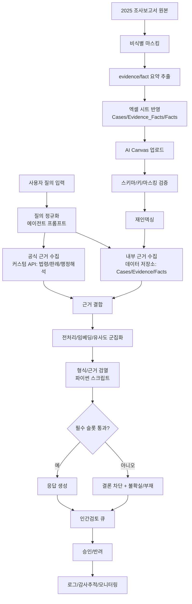
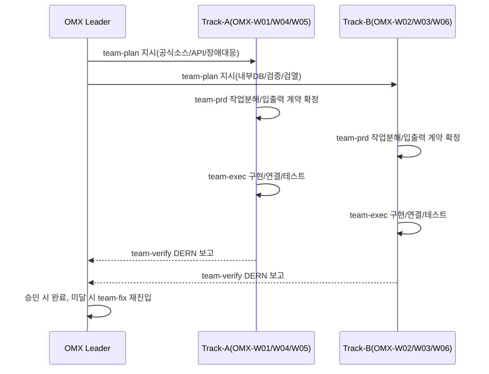
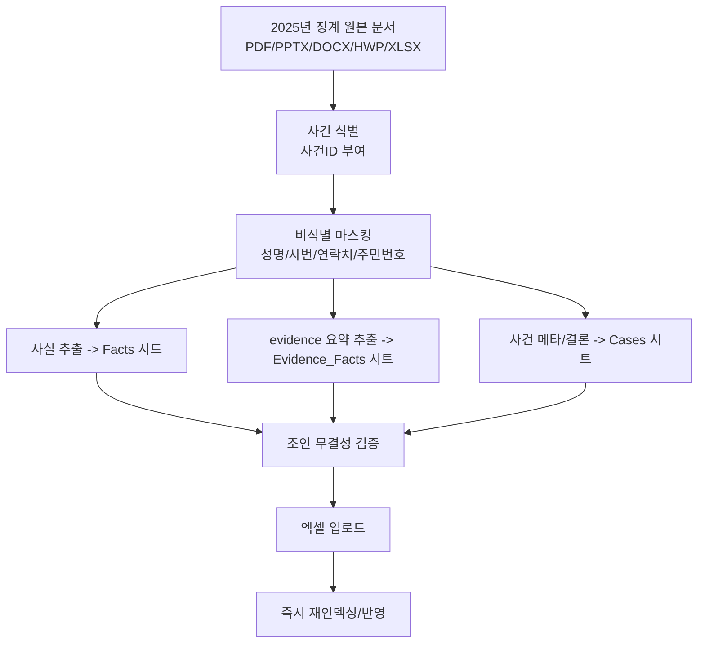
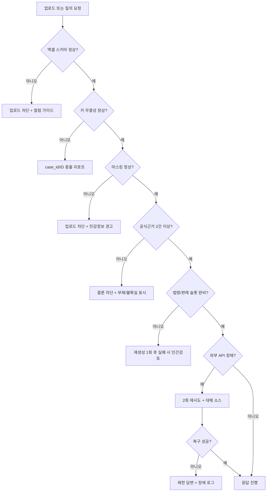
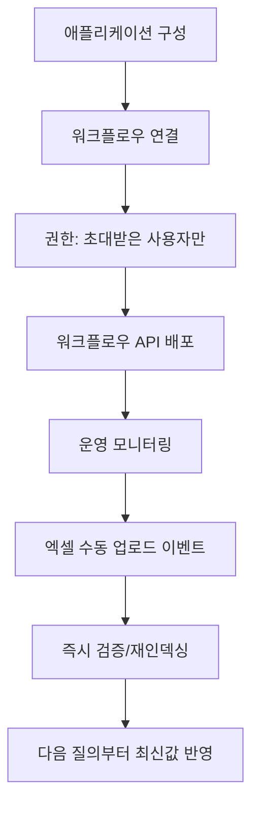

# AI Canvas 징계 챗봇 실행 설계도 (`act.md`)

## 1. 문서 목적/범위/전제
- 목적: 구현자가 추가 의사결정 없이 바로 구축 가능한 실행 순서도, 노드 연결도, 데이터 계약, 검증 기준을 제공한다.
- 범위: `노동/징계` 도메인을 우선 적용하고, 공식 법령/판례/행정해석 + 내부 DB evidence를 결합한 고신뢰 챗봇을 구축한다.
- 핵심 원칙:
- 근거 우선순위: `공식 법령/판례/행정해석 > 내부 DB 요약 evidence > 학술/일반자료`
- 내부 evidence 단독 결론 금지
- 결론은 인간검토(법무/노무) 승인 후 확정
- 응답은 근거 슬롯 누락 시 자동 차단
- 내부 데이터 반영 전제:
- 업로드 파일: `★징계DB_AI활용 DB최종 작성중.xlsx`
- 원천 문서: `2025년 징계` 폴더 내 조사/보고/판정/소송 관련 파일
- AI Canvas에는 비식별 마스킹 데이터만 업로드

## 2. 팀 구성 스냅샷 (oh-my-codex Team)
- 기준: `OMX team 모드(leader + workers)`와 `team-plan -> team-prd -> team-exec -> team-verify -> team-fix` 단계
- `OMX Leader`: 정책 결정, 승인/반려, 최종 품질 책임
- `OMX-W01`: 외부 API 연동(법령/판례/행정해석)
- `OMX-W02`: 내부 DB 인입/정합성/키관리
- `OMX-W03`: 근거 결합/검색/RAG 품질
- `OMX-W04`: AI Canvas 노드 구현/E2E
- `OMX-W05`: 장애대응/재시도/모니터링
- `OMX-W06`: 검열 스크립트/출력 형식 강제

## 3. 데이터 소스 우선순위 정책
| 우선순위 | 소스 | 용도 | 비고 |
|---|---|---|---|
| 1 | 국가법령정보 공동활용(Open API) | 법령 원문/시행일/개정이력 | 최우선 근거 |
| 1 | 국가법령정보센터 판례 + 사법정보공개포털 | 판례 식별/사건번호/판시요지 검증 | 판례 슬롯 필수 |
| 1 | 행정해석/행정지침 공식 채널 | 해석례 보강 | 출처 링크 강제 |
| 2 | 내부 엑셀 DB(`Cases`, `Evidence_Facts`, `Facts`) | 유사사례/내부 판단 맥락 | 보조 논거만 허용 |
| 3 | 일반 문헌/학술 | 참고용 | 결론 근거 불가 |

## 4. 전체 E2E 순서도


요약:
- 질의 경로와 데이터 인입 경로를 분리하고, 인입 검증 통과 데이터만 질의에 사용한다.
- 최종 응답은 검열 게이트 + 인간검토 승인 조건을 모두 충족해야 한다.

## 5. OMX 오케스트레이션 순서도


요약:
- 모든 핵심 변경은 최소 2라운드 리뷰를 강제한다.
- 최종 승인권은 `OMX Leader`가 가지며, 미충족 항목은 `team-fix` 루프로 재검증한다.

## 6. AI Canvas 노드 연결 순서도 + 단계 표
```mermaid
flowchart LR
    N1[챗 UI/에이전트] --> N2[에이전트 메시지 가로채기] --> N3[에이전트 프롬프트\n질의 정규화]
    N3 --> N4a[커스텀 API\n법령]
    N3 --> N4b[커스텀 API\n판례]
    N3 --> N4c[커스텀 API\n행정해석]
    N3 --> N4d[데이터 저장소 조회\n내부 DB]
    N4a --> N5[근거 결합]
    N4b --> N5
    N4c --> N5
    N4d --> N5
    N5 --> N6[텍스트 전처리] --> N7[텍스트 임베딩] --> N8[유사도 군집화] --> N9[파이썬 스크립트\n형식/근거 검열] --> N10[에이전트로 전달]

    D1[데이터(Excel)] --> D2[전처리(스키마/마스킹 검증)] --> D3[데이터 저장소 적재] --> D4[재인덱싱] --> N4d
```

| 단계 | 노드 | 입력 | 출력 | 실패조건 | 담당 |
|---|---|---|---|---|---|
| 1 | 챗 UI/에이전트 | 사용자 질의 | 질의 원문 | 입력 누락 | OMX-W06 |
| 2 | 메시지 가로채기 | 질의 원문 | 가로챈 메시지 | 트리거 미작동 | OMX-W04 |
| 3 | 에이전트 프롬프트 | 메시지 | 구조화 질의 JSON | 입력 계약 불일치 | OMX-W02 |
| 4 | 커스텀 API(법령/판례/행정해석) | 구조화 질의 | 공식 근거셋 | API 실패/빈결과 | OMX-W01/OMX-W05 |
| 5 | 내부DB 조회 | `case_id`, 키워드 | 내부 evidence셋 | 조인키 미매칭 | OMX-W02 |
| 6 | 근거 결합 | 공식+내부 근거 | 통합 근거셋 | 충돌 미해결 | OMX-W03 |
| 7 | 전처리/임베딩/군집 | 통합 근거셋 | 요약 후보 근거셋 | 임베딩/군집 실패 | OMX-W03/OMX-W05 |
| 8 | 검열 스크립트 | 응답 초안+근거 | 통과/차단 판정 | 필수 슬롯 누락 | OMX-W06 |
| 9 | 에이전트 전달 | 통과 응답 | 사용자 응답 | 전달 실패 | OMX-W04 |
| 10 | Excel 인입 전처리 | 업로드 엑셀 | 검증 리포트 | 스키마/마스킹 오류 | OMX-W02 |
| 11 | 데이터 저장소 적재 | 검증 통과 데이터 | 저장 완료 | PK/FK 오류 | OMX-W02/OMX-W03 |
| 12 | 재인덱싱 | 저장 완료 이벤트 | 최신 검색 인덱스 | 인덱싱 실패 | OMX-W05 |

## 7. 조사보고서 → 내부 DB 적재 순서도


요약:
- 조사보고서 원문은 외부 보관하고, AI Canvas에는 비식별 요약/구조화 데이터만 반영한다.
- `Facts`/`Evidence_Facts`/`Cases` 3개 시트가 핵심 운영 테이블이다.

## 8. 입력/출력 JSON 계약

### 8.1 워크플로우 입력 계약 v1
```json
{
  "case_type": "string",
  "incident_date": "YYYY-MM-DD",
  "facts": "string",
  "requested_outcome": "string",
  "attachments": [],
  "locale": "ko-KR",
  "user_role": "string"
}
```

### 8.2 워크플로우 출력 계약 v1.1
```json
{
  "mode_banner": "[🟢 Online Mode | YYYY.MM.DD_HH:mm:ss]",
  "search_strategy": "string",
  "facts_summary": "string",
  "issues": [],
  "statutes": [
    {
      "law_name": "string",
      "article": "string",
      "effective_date": "YYYY-MM-DD",
      "source_url": "string"
    }
  ],
  "precedents": [
    {
      "court": "string",
      "decision_date": "YYYY-MM-DD",
      "case_number": "string",
      "holding": "string",
      "source_url": "string"
    }
  ],
  "internal_refs": [],
  "internal_evidence_ids": [],
  "internal_evidence_used": true,
  "final_assessment": "string",
  "next_actions": [],
  "uncertainty": []
}
```

### 8.3 내부 evidence 객체 계약 v1
```json
{
  "case_id": "string",
  "evidence_id": "string",
  "evidence_summary": "string",
  "source_report_ref": "string",
  "masked": true,
  "updated_at": "YYYY-MM-DDTHH:mm:ssZ",
  "review_status": "draft|reviewed|approved"
}
```

## 9. 내부 DB 스키마 계약 (실제 엑셀 컬럼 반영)

### 9.1 운영 시트/키 계약
| 시트 | 역할 | 기본 키 | 필수 조인 키 |
|---|---|---|---|
| `Cases` | 사건 메타/판단/징계결론 | `사건ID*` | `적용규정ID` |
| `Evidence_Facts` | 증거 요약/채택 여부 | `항목ID*` | `사건ID*`, `연결사실ID(선택)` |
| `Facts` | 요건사실/쟁점 구조화 | `사실ID*` | `사건ID*`, `연결증거항목ID들(콤마)` |
| `Rules` | 내부 규정 원문 요약 | `규정ID*` | `문서명*`, `조항번호` |
| `Sanction_level` | 징계 레벨 매핑 | `징계명` | `Level` |
| `Sanction_Guideline` | 양정 가이드 텍스트 | (복합) | `대분류`, `행위유형` |
| `Opinion_Letters` | 의견서/권고양정 기록 | `의견서ID*` | `사건ID(선택)`, `근거규정ID들(콤마)` |

### 9.2 시트별 컬럼 참조 (원본 반영)

#### `Cases` (35)
`사건ID*`, `사원번호`, `성명`, `사원유형`, `직위`, `재직여부`, `징계부문`, `접수일`, `발생일`, `심의 확정일`, `대분류`, `소분류`, `취업규칙 근거`, `추가혐의_소분류들`, `추가혐의_근거표기`, `신고요지(주장)*`, `쟁점(핵심 판단 포인트)`, `조사결론요약(사실인정)*`, `성립요건판단(요건별)`, `규정위반 성립여부 판단*`, `징계대상여부(Y/N)*`, `징계양정(검토)`, `양정사유요약(가중/감경 포함)`, `가중요소(세미콜론;로 구분)`, `감경요소(세미콜론;로 구분)`, `적용규정ID`, `적용규정 세부`, `키워드`, `징계상세내용`, `최종징계명(표준)`, `최종징계Level(0~6)`, `징계기간`, `징계시작일자`, `징계종료일자`, `기록종료일`

#### `Evidence_Facts` (12)
`사건ID*`, `항목ID*`, `항목유형*`, `출처(신고인/피신고인/참고인/로그 등)`, `내용요약*`, `원문발췌(선택)`, `채택여부(Y/N)*`, `신뢰도(선택)`, `판단영향(왜 중요했는지)`, `키워드(콤마)`, `첨부파일명/링크`, `연결사실ID(선택)`

#### `Facts` (8)
`사건ID*`, `사실ID*`, `사실유형(행위/피해/정황/절차)`, `사실요약*`, `쟁점여부(Y/N)`, `관련규정ID들(콤마)`, `연결증거항목ID들(콤마)`, `비고`

#### `Rules` (5)
`규정ID*`, `문서명*`, `조항번호`, `조항제목`, `주요 내용`

#### `Opinion_Letters` (9)
`의견서ID*`, `사건ID(선택)`, `작성일`, `제목`, `본문*`, `태그(콤마)`, `권고양정(텍스트)`, `근거규정ID들(콤마)`, `비고`

#### `Sanction_Guideline` (8)
`문서유형`, `제목`, `내용`, `대분류`, `행위유형`, `조건유형`, `조건내용`, `조건충족시수위`

#### `Sanction_level` (3)
`징계명`, `Level`, `징계군`

### 9.3 내부 조인 규칙
- 기준 키 매핑:
- `case_id` = `Cases.사건ID*`
- `evidence_id` = `Evidence_Facts.항목ID*`
- `fact_id` = `Facts.사실ID*`
- `rule_id` = `Rules.규정ID*`
- 필수 조인:
- `Cases.사건ID* = Evidence_Facts.사건ID*`
- `Cases.사건ID* = Facts.사건ID*`
- `Facts.연결증거항목ID들(콤마)` -> `Evidence_Facts.항목ID*` (콤마 분해 후 매핑)
- `Cases.적용규정ID`/`Facts.관련규정ID들(콤마)` -> `Rules.규정ID*`
- `Cases.최종징계명(표준)` 또는 `최종징계Level(0~6)` -> `Sanction_level`

## 10. 인입 검증 규칙 (엑셀 기준)

### 10.1 스키마 검증
- 필수 시트 누락 시 업로드 차단: `Cases`, `Evidence_Facts`, `Facts`, `Rules`, `Sanction_level`
- 필수 컬럼 누락 시 업로드 차단:
- `Cases`: `사건ID*`, `신고요지(주장)*`, `조사결론요약(사실인정)*`, `규정위반 성립여부 판단*`, `징계대상여부(Y/N)*`
- `Evidence_Facts`: `사건ID*`, `항목ID*`, `항목유형*`, `내용요약*`, `채택여부(Y/N)*`
- `Facts`: `사건ID*`, `사실ID*`, `사실요약*`
- `Rules`: `규정ID*`, `문서명*`

### 10.2 키/참조 무결성 검증
- `Cases.사건ID*` 중복/공란 차단
- `Evidence_Facts.항목ID*` 중복/공란 차단
- `Facts.사실ID*` 중복/공란 차단
- `Evidence_Facts.사건ID*`, `Facts.사건ID*`는 `Cases.사건ID*`에 반드시 존재해야 함
- `Facts.연결증거항목ID들(콤마)`의 모든 ID는 `Evidence_Facts.항목ID*`에 존재해야 함

### 10.3 값 품질 검증
- `Evidence_Facts.내용요약*` 공란 차단
- `Evidence_Facts.채택여부(Y/N)*`는 `Y|N`만 허용
- `Cases.징계대상여부(Y/N)*`는 `Y|N`만 허용
- `Cases.최종징계Level(0~6)` 숫자 범위 검증(0~6)
- 날짜 정규화:
- ISO(`YYYY-MM-DD`) 허용
- Excel serial 값(예: `37515`)은 업로드 시 ISO로 변환 후 저장

### 10.4 비식별 마스킹 검증
- 마스킹 대상: 성명, 사번, 연락처, 이메일, 주민등록번호 패턴
- `2025년 징계` 원본 문서는 저장소 외부 보관
- `첨부파일명/링크`에는 원본 전문 대신 내부 참조키(`source_report_ref`)만 저장

## 11. 근거 사용 정책 및 법적 타당성 게이트

### 11.1 근거 채택 규칙
- 공식근거 최소 2건(법령 1 + 판례/행정해석 1 이상) 없으면 `final_assessment` 차단
- 내부 evidence는 보조 논거로만 사용
- 내부 evidence가 공식근거와 충돌하면 공식근거 우선
- 공식근거가 부족하면 반드시 `uncertainty`에 `부재/불충분` 표기

### 11.2 인용 강제 슬롯
- 법령 슬롯 필수: `법령명`, `조문`, `시행일`, `source_url`
- 판례 슬롯 필수: `법원`, `선고일`, `사건번호`, `source_url`
- 내부 슬롯 표기: `internal_evidence_used`, `internal_evidence_ids`
- 링크 누락 시 검열 단계 실패 처리

### 11.3 결론 차단 규칙
- 근거 없는 단정 문장 발견 시 차단
- `statutes` 또는 `precedents` 빈 배열이면 결론 차단
- 징계 수위 제안은 `Sanction_level` 또는 `Sanction_Guideline` 매핑 실패 시 차단
- 고위험 답변(해고/중징계/소송 대응)은 인간검토 승인 전 외부 제공 금지

## 12. 실패/예외 분기 순서도


요약:
- 인입 오류는 업로드 단계에서 차단하고, 질의 단계로 넘기지 않는다.
- 응답 단계에서는 근거 슬롯/링크 누락 시 결론을 차단한다.

## 13. 배포/권한/운영 순서도


요약:
- 운영 기본 권한은 `초대받은 사용자만`으로 고정한다.
- 재업로드 즉시 반영을 표준 트리거로 사용한다.

## 14. DERN 보고 템플릿
```text
Decision:
- 이번 라운드 확정/변경 사항

Evidence:
- 테스트 결과
- 공식근거 링크
- 내부 evidence 참조 ID

Risk:
- 법적/기술/운영 리스크

Request:
- 승인 요청 또는 지원 요청

Next:
- 다음 액션
- ETA
```

## 15. 검증 시나리오 및 통과 기준

### 15.1 정상 인입/정상 응답
- 조건: 필수 시트/필수 컬럼/무결성/마스킹 모두 통과
- 기대결과: 재인덱싱 성공, 응답에 법령+판례+내부 evidence 표시

### 15.2 `사건ID*` 충돌
- 조건: `Cases.사건ID*` 중복
- 기대결과: 업로드 차단, 충돌 행 번호 리포트

### 15.3 `항목ID*` 충돌
- 조건: `Evidence_Facts.항목ID*` 중복
- 기대결과: 업로드 차단, 충돌 ID 목록 리포트

### 15.4 마스킹 실패
- 조건: 성명/사번/주민번호 패턴 검출
- 기대결과: 업로드 차단, 민감정보 경고 로그

### 15.5 참조 무결성 실패
- 조건: `Facts.연결증거항목ID들` 중 존재하지 않는 `항목ID*` 포함
- 기대결과: 업로드 차단, 잘못된 ID 목록 리포트

### 15.6 공식근거 부족
- 조건: 법령/판례 슬롯 미충족
- 기대결과: `final_assessment` 차단 + `uncertainty`에 부재 명시

### 15.7 외부 API 장애
- 조건: 법령 API 또는 판례 API 실패
- 기대결과: 재시도 후 대체 소스; 미복구 시 제한 답변 + 장애로그

### 15.8 내부 evidence 사용 고지
- 조건: 내부 evidence가 응답에 사용됨
- 기대결과: `internal_evidence_used=true`, `internal_evidence_ids` 채움

### 15.9 최신성
- 조건: 엑셀 재업로드
- 기대결과: 즉시 재인덱싱되고 다음 질의부터 최신 데이터 조회

## 16. 구현 순서(일차별) 및 담당
| 일차 | 작업 | 담당 |
|---|---|---|
| Day 1 | 입력/출력 계약 v1.1 고정, 에이전트 진입 구성 | OMX-W02, OMX-W06 |
| Day 2 | 공식 소스 API(법령/판례/행정해석) 연동 | OMX-W01, OMX-W04 |
| Day 3 | 엑셀 인입 파이프라인(스키마/키/마스킹 검증) 구현 | OMX-W02, OMX-W03 |
| Day 4 | 내부 조인/근거 결합/임베딩/군집화 구현 | OMX-W03, OMX-W05 |
| Day 5 | 검열 스크립트(슬롯/링크/차단 규칙) 구현 | OMX-W06, OMX-W04 |
| Day 6 | 예외 분기/재시도/장애 로깅/운영 지표 | OMX-W05, OMX-W01 |
| Day 7 | 배포/권한 설정/인간검토 게이트 리허설 | OMX Leader + 전원 |

## 17. 바로 구현 체크리스트 (10항목)
1. `Cases`, `Evidence_Facts`, `Facts`, `Rules`, `Sanction_level` 시트 존재 검증을 구현했다.
2. `Cases.사건ID*`, `Evidence_Facts.항목ID*`, `Facts.사실ID*` 유일성 검증을 구현했다.
3. `내용요약*` 공란 차단과 `Y/N` 필드 검증을 구현했다.
4. `연결증거항목ID들(콤마)` 참조 무결성 검증을 구현했다.
5. 비식별 마스킹 규칙(성명/사번/연락처/주민번호)을 구현했다.
6. 공식근거 2건 미만 결론 차단을 구현했다.
7. 법령/판례 필수 슬롯 + 링크 누락 차단을 구현했다.
8. `internal_evidence_used`, `internal_evidence_ids` 출력을 반영했다.
9. 수동 엑셀 업로드 즉시 재인덱싱 트리거를 연결했다.
10. 배포 권한을 `초대받은 사용자만`으로 고정했다.
