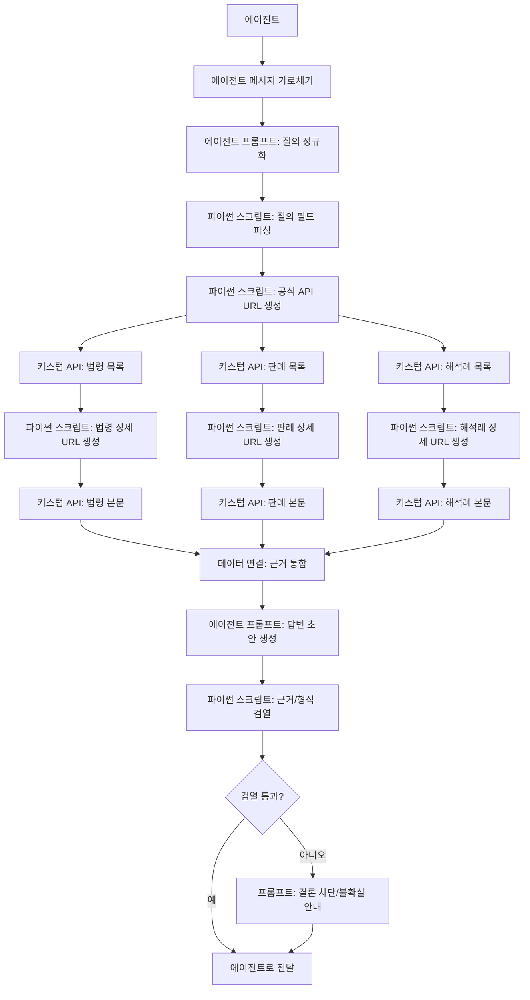

# Step 1 실행 가이드: AI Canvas 플로우 구축 + 외부 근거 정확도 검증 (내부 DB 제외)

## 0. 문서 목적
- 목적: 내부 DB를 붙이기 전, AI Canvas에서 `공식 법령/판례/행정해석` 기반 답변이 안정적으로 나오도록 1단계 워크플로우를 완성한다.
- 범위: 외부 근거 수집, 근거 강제 출력, 형식/출처 검열, 에이전트 응답 반환까지.
- 제외: 내부 엑셀 DB(`Cases`, `Evidence_Facts`, `Facts`) 연동은 2단계에서 수행.
- 원칙: `노동법 RAG` PDF는 AI Canvas에 업로드하지 않는다. 필요 시 API로 실시간 조회한다.

## 1. 완료 기준 (Definition of Done)
1. 사용자 질의 10건 중 10건에서 응답에 공식근거 슬롯이 채워진다.
2. 응답마다 최소 2개 공식근거(법령 1 + 판례/행정해석 1)가 존재한다.
3. 출처 URL 도메인이 허용 목록(`law.go.kr`, `open.law.go.kr`, `scourt.go.kr`)을 벗어나면 결론이 자동 차단된다.
4. 근거 부족/외부 API 실패 시 `불확실/부재`가 강제 출력된다.
5. 내부 DB 없이도 챗 UI에서 왕복 대화가 정상 동작한다.
6. `노동법 RAG` PDF에서 추출한 법령 시드(법률/시행령/시행규칙)를 API로 일괄 조회할 수 있다.

## 2. 사전 준비
- AI Canvas 워크스페이스 생성 권한
- 국가법령정보 공동활용 `OC` 값
- 테스트용 질의 세트 10개
- 배포 전용 체크리스트(본 문서 10장)

### 2.1 필수 고정값
| 항목 | 값 |
|---|---|
| 도메인 화이트리스트 | `law.go.kr`, `open.law.go.kr`, `portal.scourt.go.kr`, `ecfs.scourt.go.kr` |
| 기본 출력 형식 | JSON 슬롯 강제 + 한국어 문장 응답 |
| 결론 차단 조건 | 공식근거 2건 미만, 필수 슬롯 누락, 출처 도메인 이탈 |
| 내부 DB 사용 여부 | `false` (Step 1 동안 고정) |
| 노동법 RAG PDF 업로드 | `false` (파일 업로드 금지, API 조회만 사용) |

### 2.2 OC 고정값
- 적용 OC: `tud1211`
- 반영 방식: 커스텀 API 노드의 URL 쿼리에 `OC=tud1211`를 직접 포함
- 주의: AI Canvas 커스텀 API 노드에는 `OC` 전용 입력칸이 없으므로 URL에 넣어야 함

## 3. 전체 아키텍처 (Step 1)


## 4. 노드 배치 목록
| No | 노드명 | 카테고리 | 목적 |
|---|---|---|---|
| 1 | 에이전트 | UI | 사용자 대화 진입점 |
| 2 | 에이전트 메시지 가로채기 | 데이터 | 사용자 요청을 워크플로우로 전달 |
| 3 | 에이전트 프롬프트_질의정규화 | API | 사건유형/키워드/기간/쟁점 구조화 |
| 4 | 파이썬_정규화파싱 | 전처리 | 프롬프트 JSON 파싱 후 컬럼화 |
| 5 | 파이썬_URL생성 | 전처리 | 법령/판례/해석 API URL 생성 |
| 6 | API_법령목록 | API/커스텀 API | 법령 후보 수집 |
| 7 | API_판례목록 | API/커스텀 API | 판례 후보 수집 |
| 8 | API_해석목록 | API/커스텀 API | 행정해석 후보 수집 |
| 9 | 파이썬_법령상세URL | 전처리 | 법령 ID/MST 기반 본문 URL 생성 |
| 10 | 파이썬_판례상세URL | 전처리 | 판례 ID 기반 본문 URL 생성 |
| 11 | 파이썬_해석상세URL | 전처리 | 해석례 ID 기반 본문 URL 생성 |
| 12 | API_법령본문 | API/커스텀 API | 조문/시행일 확보 |
| 13 | API_판례본문 | API/커스텀 API | 사건번호/판시요지 확보 |
| 14 | API_해석본문 | API/커스텀 API | 질의요지/회답/이유 확보 |
| 15 | 데이터 연결_근거통합 | 전처리 | 3개 근거셋 통합 |
| 16 | 에이전트 프롬프트_답변생성 | API | 법적 검토 답변 초안 |
| 17 | 파이썬_검열게이트 | 전처리 | 슬롯/도메인/근거 수 검증 |
| 18 | 데이터 조건 분기 | 데이터 | 통과/차단 분기 |
| 19 | 프롬프트_차단응답 | API | 근거 부족 안내문 생성 |
| 20 | 에이전트로 전달 | 데이터 | 사용자에게 최종 응답 반환 |

## 5. 공식 API 스펙 고정 (Step 1 핵심)

### 5.1 법령
| 구분 | URL | 주요 파라미터 |
|---|---|---|
| 법령 목록 | `https://www.law.go.kr/DRF/lawSearch.do?OC=tud1211&target=eflaw&type=JSON` | `search`, `query`, `display`, `page`, `sort`, `org`, `LID`, `efYd` |
| 법령 본문 | `https://www.law.go.kr/DRF/lawService.do?OC=tud1211&target=eflaw&type=JSON` | `ID` 또는 `MST`, `efYd`, `JO` |

### 5.2 판례
| 구분 | URL | 주요 파라미터 |
|---|---|---|
| 판례 목록 | `https://www.law.go.kr/DRF/lawSearch.do?OC=tud1211&target=prec&type=JSON` | `search`, `query`, `display`, `page`, `sort`, `date`, `nb`, `org`, `curt`, `datSrcNm` |
| 판례 본문 | `https://www.law.go.kr/DRF/lawService.do?OC=tud1211&target=prec&type=JSON` | `ID`, `LM` |

### 5.3 법령해석례
| 구분 | URL | 주요 파라미터 |
|---|---|---|
| 해석례 목록 | `https://www.law.go.kr/DRF/lawSearch.do?OC=tud1211&target=expc&type=JSON` | `search`, `query`, `display`, `page`, `inq`, `rpl`, `itmno`, `regYd`, `explYd`, `sort` |
| 해석례 본문 | `https://www.law.go.kr/DRF/lawService.do?OC=tud1211&target=expc&type=JSON` | `ID`, `LM` |

### 5.4 복사-붙여넣기용 URL (OC 반영 완료)
아래 URL은 그대로 복사해서 커스텀 API 노드 URL에 붙여넣으면 된다.

```text
# 법령 목록 (키워드: 직장 내 괴롭힘)
https://www.law.go.kr/DRF/lawSearch.do?OC=tud1211&target=eflaw&type=JSON&search=1&query=%EC%A7%81%EC%9E%A5%20%EB%82%B4%20%EA%B4%B4%EB%A1%AD%ED%9E%98&display=5&page=1&sort=ddes

# 법령 본문 (샘플 ID=1747)
https://www.law.go.kr/DRF/lawService.do?OC=tud1211&target=eflaw&ID=1747&type=JSON

# 법령 본문 조문 조회 (샘플 MST/efYd/JO)
https://www.law.go.kr/DRF/lawService.do?OC=tud1211&target=eflaw&MST=166520&efYd=20151007&JO=000300&type=JSON

# 판례 목록 (키워드: 징계해고)
https://www.law.go.kr/DRF/lawSearch.do?OC=tud1211&target=prec&type=JSON&search=1&query=%EC%A7%95%EA%B3%84%ED%95%B4%EA%B3%A0&display=5&page=1&sort=ddes

# 판례 본문 (샘플 ID=228541)
https://www.law.go.kr/DRF/lawService.do?OC=tud1211&target=prec&ID=228541&type=JSON

# 판례 목록 (근로복지공단산재판례 필터)
https://www.law.go.kr/DRF/lawSearch.do?OC=tud1211&target=prec&type=JSON&datSrcNm=%EA%B7%BC%EB%A1%9C%EB%B3%B5%EC%A7%80%EA%B3%B5%EB%8B%A8%EC%82%B0%EC%9E%AC%ED%8C%90%EB%A1%80

# 해석례 목록 (키워드: 징계)
https://www.law.go.kr/DRF/lawSearch.do?OC=tud1211&target=expc&type=JSON&search=1&query=%EC%A7%95%EA%B3%84&display=5&page=1&sort=ddes

# 해석례 본문 (샘플 ID=330471)
https://www.law.go.kr/DRF/lawService.do?OC=tud1211&target=expc&ID=330471&type=JSON

# 해석례 본문 (LM 포함 샘플)
https://www.law.go.kr/DRF/lawService.do?OC=tud1211&target=expc&ID=315191&LM=%EC%97%AC%EC%84%B1%EA%B0%80%EC%A1%B1%EB%B6%80%20-%20%EA%B1%B4%EA%B0%95%EA%B0%80%EC%A0%95%EA%B8%B0%EB%B3%B8%EB%B2%95%20%EC%A0%9C35%EC%A1%B0%20%EC%A0%9C2%ED%95%AD%20%EA%B4%80%EB%A0%A8&type=JSON
```

### 5.5 근거 파일(로컬)
- `lsEfYdListGuide.html`
- `lsEfYdInfoGuide.html`
- `precListGuide.html`
- `precInfoGuide.html`
- `expcListGuide.html`
- `expcInfoGuide.html`

### 5.6 노동법 RAG PDF 기반 법령 시드
`노동법 RAG` 폴더의 PDF 파일명에서 법령명을 정규화해 API 검색 시드로 사용한다.
PDF 원문은 참고용이며, AI Canvas에는 업로드하지 않는다.

#### 5.6.1 검색 대상 시드 (전수)
```text
개인정보 보호법
국가인권위원회법
근로기준법
근로기준법 시행령
고용상 연령차별금지 및 고령자고용촉진에 관한 법률
남녀고용평등과 일ㆍ가정 양립 지원에 관한 법률
노동조합 및 노동관계조정법
노동조합 및 노동관계조정법 시행령
근로자참여 및 협력증진에 관한 법률
산업안전보건법
산업안전보건법 시행령
산업안전보건기준에 관한 규칙
산업재해보상보험법
중대재해 처벌 등에 관한 법률
```

#### 5.6.2 참고 문서형(단일 법령 아님, 보조용)
```text
노동법전
형사법 및 형사특별법
```

#### 5.6.3 전수 조회 URL 생성 규칙
- 기본 패턴:
`https://www.law.go.kr/DRF/lawSearch.do?OC=tud1211&target=eflaw&type=JSON&search=1&query={URL_ENCODED_법령명}&display=5&page=1&sort=ddes`
- 결과 1순위 선택 기준:
1. 법령명 완전일치
2. `법령구분명`이 시드 유형과 일치(법률/대통령령/부령)
3. 시행일 최신

#### 5.6.4 전수 조회 복사-붙여넣기 URL (14건)
```text
https://www.law.go.kr/DRF/lawSearch.do?OC=tud1211&target=eflaw&type=JSON&search=1&query=%EA%B0%9C%EC%9D%B8%EC%A0%95%EB%B3%B4%20%EB%B3%B4%ED%98%B8%EB%B2%95&display=5&page=1&sort=ddes
https://www.law.go.kr/DRF/lawSearch.do?OC=tud1211&target=eflaw&type=JSON&search=1&query=%EA%B5%AD%EA%B0%80%EC%9D%B8%EA%B6%8C%EC%9C%84%EC%9B%90%ED%9A%8C%EB%B2%95&display=5&page=1&sort=ddes
https://www.law.go.kr/DRF/lawSearch.do?OC=tud1211&target=eflaw&type=JSON&search=1&query=%EA%B7%BC%EB%A1%9C%EA%B8%B0%EC%A4%80%EB%B2%95&display=5&page=1&sort=ddes
https://www.law.go.kr/DRF/lawSearch.do?OC=tud1211&target=eflaw&type=JSON&search=1&query=%EA%B7%BC%EB%A1%9C%EA%B8%B0%EC%A4%80%EB%B2%95%20%EC%8B%9C%ED%96%89%EB%A0%B9&display=5&page=1&sort=ddes
https://www.law.go.kr/DRF/lawSearch.do?OC=tud1211&target=eflaw&type=JSON&search=1&query=%EA%B3%A0%EC%9A%A9%EC%83%81%20%EC%97%B0%EB%A0%B9%EC%B0%A8%EB%B3%84%EA%B8%88%EC%A7%80%20%EB%B0%8F%20%EA%B3%A0%EB%A0%B9%EC%9E%90%EA%B3%A0%EC%9A%A9%EC%B4%89%EC%A7%84%EC%97%90%20%EA%B4%80%ED%95%9C%20%EB%B2%95%EB%A5%A0&display=5&page=1&sort=ddes
https://www.law.go.kr/DRF/lawSearch.do?OC=tud1211&target=eflaw&type=JSON&search=1&query=%EB%82%A8%EB%85%80%EA%B3%A0%EC%9A%A9%ED%8F%89%EB%93%B1%EA%B3%BC%20%EC%9D%BC%E3%86%8D%EA%B0%80%EC%A0%95%20%EC%96%91%EB%A6%BD%20%EC%A7%80%EC%9B%90%EC%97%90%20%EA%B4%80%ED%95%9C%20%EB%B2%95%EB%A5%A0&display=5&page=1&sort=ddes
https://www.law.go.kr/DRF/lawSearch.do?OC=tud1211&target=eflaw&type=JSON&search=1&query=%EB%85%B8%EB%8F%99%EC%A1%B0%ED%95%A9%20%EB%B0%8F%20%EB%85%B8%EB%8F%99%EA%B4%80%EA%B3%84%EC%A1%B0%EC%A0%95%EB%B2%95&display=5&page=1&sort=ddes
https://www.law.go.kr/DRF/lawSearch.do?OC=tud1211&target=eflaw&type=JSON&search=1&query=%EB%85%B8%EB%8F%99%EC%A1%B0%ED%95%A9%20%EB%B0%8F%20%EB%85%B8%EB%8F%99%EA%B4%80%EA%B3%84%EC%A1%B0%EC%A0%95%EB%B2%95%20%EC%8B%9C%ED%96%89%EB%A0%B9&display=5&page=1&sort=ddes
https://www.law.go.kr/DRF/lawSearch.do?OC=tud1211&target=eflaw&type=JSON&search=1&query=%EA%B7%BC%EB%A1%9C%EC%9E%90%EC%B0%B8%EC%97%AC%20%EB%B0%8F%20%ED%98%91%EB%A0%A5%EC%A6%9D%EC%A7%84%EC%97%90%20%EA%B4%80%ED%95%9C%20%EB%B2%95%EB%A5%A0&display=5&page=1&sort=ddes
https://www.law.go.kr/DRF/lawSearch.do?OC=tud1211&target=eflaw&type=JSON&search=1&query=%EC%82%B0%EC%97%85%EC%95%88%EC%A0%84%EB%B3%B4%EA%B1%B4%EB%B2%95&display=5&page=1&sort=ddes
https://www.law.go.kr/DRF/lawSearch.do?OC=tud1211&target=eflaw&type=JSON&search=1&query=%EC%82%B0%EC%97%85%EC%95%88%EC%A0%84%EB%B3%B4%EA%B1%B4%EB%B2%95%20%EC%8B%9C%ED%96%89%EB%A0%B9&display=5&page=1&sort=ddes
https://www.law.go.kr/DRF/lawSearch.do?OC=tud1211&target=eflaw&type=JSON&search=1&query=%EC%82%B0%EC%97%85%EC%95%88%EC%A0%84%EB%B3%B4%EA%B1%B4%EA%B8%B0%EC%A4%80%EC%97%90%20%EA%B4%80%ED%95%9C%20%EA%B7%9C%EC%B9%99&display=5&page=1&sort=ddes
https://www.law.go.kr/DRF/lawSearch.do?OC=tud1211&target=eflaw&type=JSON&search=1&query=%EC%82%B0%EC%97%85%EC%9E%AC%ED%95%B4%EB%B3%B4%EC%83%81%EB%B3%B4%ED%97%98%EB%B2%95&display=5&page=1&sort=ddes
https://www.law.go.kr/DRF/lawSearch.do?OC=tud1211&target=eflaw&type=JSON&search=1&query=%EC%A4%91%EB%8C%80%EC%9E%AC%ED%95%B4%20%EC%B2%98%EB%B2%8C%20%EB%93%B1%EC%97%90%20%EA%B4%80%ED%95%9C%20%EB%B2%95%EB%A5%A0&display=5&page=1&sort=ddes
```

#### 5.6.5 붙여넣기 파일
- 법령명 14건: `labor_law_seed_14.txt`
- URL 14건: `labor_law_seed_urls_14.txt`

## 6. 상세 구현 절차

### 6.1 캔버스/노드 기본 세팅
1. 새 캔버스 생성: `discipline-chatbot-step1-no-internal-db`
2. 노드 1~20 배치 (전수조회 모드 사용 시 21~28 추가)
3. 노드명은 4장 표와 동일하게 리네임
4. `에이전트` 노드에서 `메시지 가로채기 노드`로 `에이전트 메시지 가로채기`를 선택
5. `에이전트` 인사말 예시: `징계 검토 요청을 입력하면 공식 법령/판례 근거 기반으로 답변합니다`

### 6.2 질의 정규화 프롬프트(노드 3)
- 모델: 비용-정확도 균형 모델(팀 표준)
- 툴 사용: 끔(정규화 단계는 계산만)
- 출력 열 이름: `normalized_json`
- 프롬프트:
```text
역할: 징계 사건 입력을 공식 검색용 구조로 정규화
반드시 JSON만 출력
스키마:
{
  "case_type": "",
  "issue_keywords": [""],
  "law_query": "",
  "precedent_query": "",
  "interpretation_query": "",
  "incident_date": "YYYY-MM-DD 또는 빈 문자열",
  "date_from": "YYYYMMDD 또는 빈 문자열",
  "date_to": "YYYYMMDD 또는 빈 문자열",
  "must_have": ["법령명","조문","시행일","법원","선고일","사건번호"]
}
규칙:
- 사용자 입력 의미를 바꾸지 말 것
- 알 수 없는 값은 빈 문자열
- 키워드는 3~7개
```

### 6.3 정규화 파싱(노드 4)
- 목적: `normalized_json` 문자열을 컬럼으로 분해
- 출력 필수 컬럼:
- `law_query`
- `precedent_query`
- `interpretation_query`
- `date_from`
- `date_to`
- `must_have`

### 6.4 API URL 생성(노드 5)
- 목적: 각 요청용 URL 컬럼 생성
- 출력 컬럼 예시:
- `law_list_url`
- `prec_list_url`
- `expc_list_url`
- 권장 규칙:
- 모든 URL에 `OC=tud1211` 고정 포함
- `type=JSON`
- `display=5`
- `page=1`
- URL 인코딩 적용
- 질의가 비면 호출하지 않도록 `skip_*` 플래그 생성
- 참고: 커스텀 API 노드에는 `OC` 별도 칸이 없으므로 URL 쿼리 파라미터로 넣어야 함

### 6.5 커스텀 API 목록 조회(노드 6~8)
공통 설정:
- 요청 모드: `데이터셋 요청`
- URL 컬럼: 각 `*_list_url`
- Method: `GET`
- 자동 변환(JSON -> CSV): `켜짐`
- URL에 이미 `OC=tud1211`가 포함되어 있어야 정상 호출됨

개별 노드:
- `API_법령목록`: `law_list_url`
- `API_판례목록`: `prec_list_url`
- `API_해석목록`: `expc_list_url`

### 6.6 상세 URL 생성(노드 9~11)
- 목록 응답에서 상세 키 추출
- 법령: `ID` 또는 `MST`
- 판례: `ID`
- 해석례: `ID`
- 각 행에서 상위 3건만 유지
- 출력 컬럼:
- `law_detail_url`
- `prec_detail_url`
- `expc_detail_url`

### 6.7 커스텀 API 본문 조회(노드 12~14)
공통 설정:
- 요청 모드: `데이터셋 요청`
- Method: `GET`
- 자동 변환(JSON -> CSV): `켜짐`
- URL에 이미 `OC=tud1211`가 포함되어 있어야 정상 호출됨

개별 노드:
- `API_법령본문`: `law_detail_url`
- `API_판례본문`: `prec_detail_url`
- `API_해석본문`: `expc_detail_url`

### 6.7A 노동법 RAG PDF 전수조회 모드(신규)
Step 1 기본 흐름과 별도로, 질의 이전에 법령 레퍼런스를 미리 구축하는 모드다.
핵심: PDF 파일 업로드 없이, 파일명에서 만든 시드로 API만 호출한다.

#### 6.7A.1 추가 노드
| No | 노드명 | 목적 |
|---|---|---|
| 21 | 여러 텍스트 입력_법령시드 | 법령명 시드 입력 |
| 22 | 파이썬_법령시드정규화 | 공백/특수문자 정리, 유형 컬럼 추가 |
| 23 | 파이썬_URL생성_법령시드 | `OC=tud1211` 포함 조회 URL 생성 |
| 24 | API_법령목록_전수 | 시드별 목록 조회 |
| 25 | 파이썬_법령상세URL_전수 | ID/MST 확정 |
| 26 | API_법령본문_전수 | 본문/조문/시행일 수집 |
| 27 | 데이터 연결_법령레퍼런스풀 | 전수 결과 통합 |
| 28 | 파이썬_전수검증 | 누락/중복/비일치 리포트 |

#### 6.7A.2 실행 순서
1. `여러 텍스트 입력_법령시드`에 5.6.1 목록을 그대로 붙여넣는다.
2. `파이썬_URL생성_법령시드`에서 시드별 `law_seed_list_url` 생성.
3. `API_법령목록_전수`로 전수 호출.
4. `파이썬_법령상세URL_전수`에서 각 시드의 최적 ID/MST 선택.
5. `API_법령본문_전수`로 본문 수집.
6. `파이썬_전수검증`에서 실패건(`not_found`, `multi_match`, `type_mismatch`) 출력.
7. 통과 데이터셋을 `법령레퍼런스풀`로 저장 후 Step 1 질의 플로우에서 참조한다.

#### 6.7A.3 전수 조회 성공 기준
- 5.6.1의 14개 법령 시드 중 14개 모두 `법령ID` 확보
- 각 법령의 `법령명`, `시행일자`, `법령상세링크` 확보
- 실패건 0개(또는 실패건은 수동 매핑표에 등록)

### 6.8 근거 통합(노드 15)
- 노드: `데이터 연결`
- 축 선택: `수직`
- 병합 방식: `공통 열 사용`
- 통합 후 최소 컬럼:
- `source_type`(law/precedent/interpretation)
- `title`
- `article_or_case_no`
- `date`
- `summary`
- `source_url`

### 6.9 답변 생성(노드 16)
- 노드: `에이전트 프롬프트`
- 툴 사용: 끔(근거는 이미 수집 완료)
- 출력 열: `draft_answer`
- 프롬프트:
```text
역할: 근거 기반 징계 검토 보고서 작성
금지: 근거에 없는 단정, 출처 없는 결론
반드시 아래 섹션 순서로 작성:
1) 사실관계 요약
2) 쟁점
3) 적용 법령 (법령명/조문/시행일/링크)
4) 관련 판례 (법원/선고일/사건번호/요지/링크)
5) 행정해석 (기관/회신일/안건번호 또는 ID/요지/링크)
6) 잠정 판단
7) 불확실/부재 항목
규칙:
- 법령 1개 + 판례/해석 1개 이상 없으면 잠정 판단 작성 금지
- 링크는 원문 URL만 허용
```

### 6.10 검열 게이트(노드 17)
- 필수 검증:
- 법령 슬롯: `법령명`, `조문`, `시행일`
- 판례 슬롯: `법원`, `선고일`, `사건번호`
- 링크 도메인 화이트리스트 검증
- 공식근거 수(`official_evidence_count`) >= 2
- 출력 컬럼:
- `is_pass` (true/false)
- `fail_reason`
- `official_evidence_count`

### 6.11 조건 분기 및 에이전트 반환(노드 18~20)
- `데이터 조건 분기` 조건: `is_pass == true`
- 참 분기: `에이전트로 전달`로 `draft_answer` 전달
- 거짓 분기: `프롬프트_차단응답` 생성 후 `에이전트로 전달`
- 차단응답 필수 문구:
- `현재 공식근거가 부족하여 결론을 제시하지 않습니다`
- `추가 사실/기간/키워드가 필요합니다`
- `불확실/부재 항목` 목록

## 7. 정확도 보장 운영 규칙
1. 블로그/카페/커뮤니티 URL은 근거에서 제외한다.
2. 동일 쟁점에 대해 법령과 판례가 충돌하면 판례 기준 + 불확실 표시를 강제한다.
3. 사건번호 형식 미검증이면 판례 슬롯을 비워두고 결론을 차단한다.
4. 법령 시행일 누락 시 법령 슬롯 미충족으로 처리한다.
5. 외부 API 장애 시 최대 2회 재시도 후 차단응답으로 전환한다.

## 8. 테스트 케이스 (Step 1)
| TC | 입력 예시 | 기대 결과 |
|---|---|---|
| 1 | `직장 내 괴롭힘 반복 폭언 건 징계 수위` | 법령+판례 슬롯 채움, 결론 제시 |
| 2 | `무단결근 3회, 경고 후 재발` | 법령 조문/판례 사건번호 포함 |
| 3 | `성희롱 의심, 증거 일부만 있음` | 불확실 항목 명시 |
| 4 | `판례 없는 매우 신종 케이스` | 결론 차단 + 근거부족 안내 |
| 5 | `법령명만 있고 사건번호 없음` | 판례 슬롯 누락으로 차단 |
| 6 | `외부 API 500 에러` | 2회 재시도 후 제한응답 |
| 7 | `키워드 너무 짧음` | 정규화 단계에서 키워드 보강 |
| 8 | `날짜 모호한 입력` | incident_date 빈값 + 불확실 표기 |
| 9 | `법원명/선고일 불일치` | 검열 실패 처리 |
| 10 | `정상 질의` | Online Mode 배너 + 슬롯 완성 |

## 9. 응답 템플릿 (최종 출력 형태)
```text
[🟢 Online Mode | YYYY.MM.DD_HH:mm:ss]

🔍 Search Strategy
- 공식 원문 채널 우선 조회
- 법령/판례/행정해석 교차검증

🧊 사실관계 요약
...

⚖️ 쟁점
...

📚 적용 법령
- 법령명 / 조문 / 시행일 / 링크

🧑‍⚖️ 관련 판례
- 법원 / 선고일 / 사건번호 / 요지 / 링크

🏛️ 행정해석
- 기관 / 회신일 / 안건번호(또는 ID) / 요지 / 링크

♟️ 잠정 판단
...

🚀 다음 액션
...

⚠️ 불확실/부재
...
```

## 10. 오늘 바로 실행 체크리스트
1. 새 캔버스 생성 및 노드 20개 배치 (전수조회 모드 사용 시 21~28 추가)
2. 에이전트-가로채기-전달 연결 확인
3. URL에 `OC=tud1211` 고정 반영 확인 (목록/본문 6개 API 모두)
4. 질의 정규화 프롬프트 저장
5. URL 생성 로직 저장
6. 커스텀 API 6개(목록/본문) 연결
7. 근거 통합 및 답변 생성 프롬프트 저장
8. 검열 게이트/분기 로직 저장
9. `노동법 RAG` 시드 14건 전수조회 모드(6.7A) 1회 실행
10. 테스트 케이스 10건 실행
11. 실패 로그 정리 후 Step 2 진입 승인

## 11. oh-my-codex 역할 분담 (실행용)
| 역할 | 담당 | 산출물 |
|---|---|---|
| OMX Leader | 최종 승인/반려 | 게이트 통과 결정 + `team-fix` 재진입 지시 |
| OMX-W01 | 공식 API 계약 | 요청/응답 스펙 고정 |
| OMX-W02 | URL/파싱/DB 인입 설계 | 컬럼/조인 계약 문서 |
| OMX-W03 | 근거 통합/정합성 | 조인/중복 제거 규칙 |
| OMX-W04 | 캔버스 구현 | 실제 노드 연결본 |
| OMX-W05 | 장애/보안/재시도 | 안정성/키보안 점검 |
| OMX-W06 | 품질게이트/검열 | 검열 로직/테스트 결과 |

## 12. 다음 단계 진입 조건 (Step 2로 넘어가기 전)
- Step 1 테스트 10건 중 실패 0건
- 결론 차단 규칙 오탐 0건
- 공식 근거 슬롯 누락 0건
- 외부 API 장애 대응 확인 완료

---

### 참고 근거 문서(공식/로컬)
- `https://open.law.go.kr/LSO/openApi/guideResult.do` (OC 필수 파라미터 기준 확인)
- `d:\AI canvas\새 폴더\lsEfYdListGuide.html`
- `d:\AI canvas\새 폴더\lsEfYdInfoGuide.html`
- `d:\AI canvas\새 폴더\precListGuide.html`
- `d:\AI canvas\새 폴더\precInfoGuide.html`
- `d:\AI canvas\새 폴더\expcListGuide.html`
- `d:\AI canvas\새 폴더\expcInfoGuide.html`
- `d:\AI canvas\새 폴더\_pdf_text\10.노드 UI.txt`
- `d:\AI canvas\새 폴더\_pdf_text\11.노드 데이터.txt`
- `d:\AI canvas\새 폴더\_pdf_text\15.노드 전처리.txt`
- `d:\AI canvas\새 폴더\_pdf_text\17.애플리케이션 및 배포.txt`
